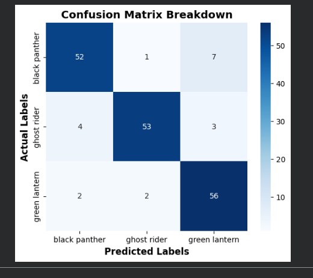
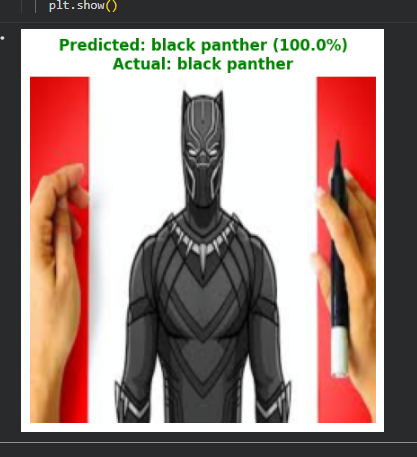
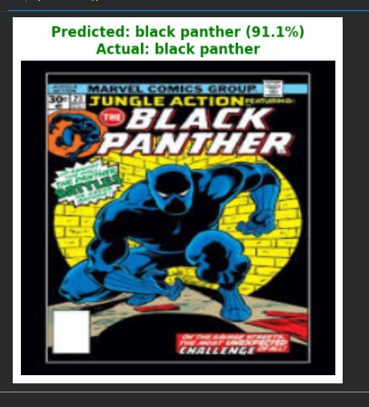
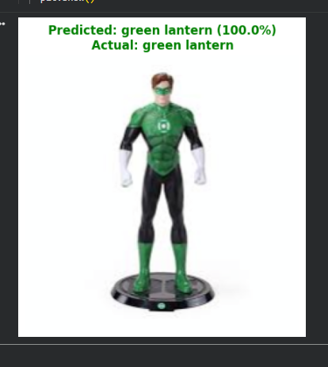
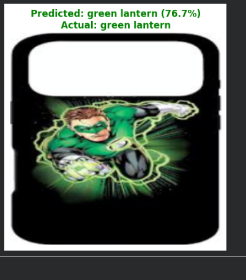

# Custom Image Classification using VGG16 & PyTorch

A high-performance deep learning pipeline built with PyTorch to classify images from the "Super" dataset. Features a custom-authored Dataset class designed for Google Drive integration, data augmentation, and Transfer Learning using a fine-tuned VGG16 architecture.

---

## 📊 Model Performance Highlights
> **Quick Overview for Recruiters:** The model achieved a (90% aprox) test accuracy** on the "Super" dataset. Below are the training dynamics and final evaluation metrics.

| Training & Validation Loss | Confusion Matrix |
| :---: | :---: |
|    *Steady loss convergence showing healthy generalization* |    *Class-by-class performance and precision* |
### 🚀 Sample Predictions

---

## 🛠️ Key Features
* **Custom PyTorch Dataset:** Fully custom-authored `Dataset` class handling dynamic path resolution and on-the-fly streaming from Google Drive.
* **Transfer Learning:** Leveraged a pre-trained **VGG16** backbone, freezing early feature-extraction layers and appending a custom-tuned classifier head.
* **Data Augmentation:** Implemented robust preprocessing (random resizing, cropping, flipping, and tensor normalization) to combat overfitting and maximize generalization.
* **Comprehensive Evaluation:** Tracked train/val loss curves and evaluated the final deployment using a complete Confusion Matrix.

## 📁 Repository Structure
* `CustomDataset(classification)_Pytorch.ipynb`: Main Jupyter Notebook containing data preprocessing, model definitions, training loops, and evaluation logic.
* `screenshots/`: Directory containing all evaluation plots, performance charts, and visual prediction samples.

## 💻 Tech Stack
* **Framework:** PyTorch
* **Architecture:** VGG16 (Transfer Learning)
* **Environment:** Jupyter Notebook / Google Colab
* **Libraries:** Torchvision, Matplotlib, NumPy, PIL
